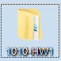
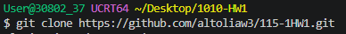
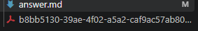
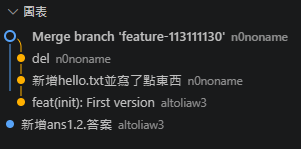

# 第1次作業題目-隨堂-HW1
>
>學號：113111130 
><br />
>姓名：黃貫栢 
><br />
>作業撰寫時間：90 
><br />
>最後撰寫文件日期：2026/10/2 
>

本份文件包含以下主題：(至少需下面兩項，若是有多者可以自行新增)
- [x] 說明內容
- [x] 其他 (可以包含心得或是想跟老師反映)

## 說明內容

開始寫說明，該說明需說明想法，
並於之後再對上述想法的每一部分將程式進一步進行展現，
若需引用程式區則使用下面方法，
若為.cs檔內程式除了於敘述中需註明檔案名稱外，
還需使用語法` ```語言種類 程式碼 ``` `，其中語言種類若是要用python則使用py，java則使用java，C/C++則使用cpp，
下段程式碼為語言種類選擇csharp使用後結果：

```csharp
public void mt_getResult(){
    ...
}
```

若要於內文中標示部分網頁檔，則使用以下標籤` ```html 程式碼 ``` `，
下段程式碼則為使用後結果：

```html
<%@ Page Language="C#" AutoEventWireup="true" ...>

<!DOCTYPE html>

<html xmlns="http://www.w3.org/1999/xhtml">
<head runat="server">
<meta http-equiv="Content-Type" ...>
    <title></title>
</head>
<body>
    <form id="form1" runat="server">
        <div>
        </div>
    </form>
</body>
</html>
```
更多markdown方法可參閱[https://ithelp.ithome.com.tw/articles/10203758](https://ithelp.ithome.com.tw/articles/10203758)

請在撰寫"說明程式與內容"該塊內容，請把原該塊內上述敘述刪除，該塊上述內容只是用來指引該怎麼撰寫內容。

# 1. 

Ans:
<br />
### 1. 在桌面新增一個資料夾

<br />
### 2. 打開vscode，新增終端找到 Git Bash，並打上 **git clone https://github.com/altoliaw3/115-1HW1.git** 

<br />
### 3. 就能看到檔案了


# 2. 
Ans:
Markdown 是一種輕量級純文字標記語言，能透過簡單符號轉換為排版完整的 HTML 或 PDF 文件。常見語法介紹如下：

1. **標題 (Headings)**：使用 1 至 6 個 `#` 代表不同層級的標題，井字號後方需空格。
2. **文字格式 (Formatting)**：文字兩側加 `**` 為粗體，加 `*` 為斜體。
3. **清單 (Lists)**：無序清單使用 `-` 加上空格；有序清單使用數字與點號如 `1.`。
4. **程式碼區塊 (Code Blocks)**：使用三個反引號包覆多行程式碼，並可在第一行標註語言種類以啟用高亮。
5. **超連結與引用**：`[文字](網址)` 可建立超連結；行首加入 `>` 可建立引用提示框。

---

#### 語法綜合展示例子：

# 專案說明文件範例
> 這是一段重要提示或引用內容。

本專案主要示範 **Git 版本控制** 與 *Markdown 排版* 的基本操作：

- 支援語言：
  - Python
  - C#
- 安裝步驟：
  1. 複製專案庫
  2. 安裝必要套件

以下為執行的指令與範例程式碼：
```bash
git clone https://github.com/example/repo.git
```

# 3. 

Ans:
<br />



# 4. 

Ans:
<br />
https://github.com/n0noname

## 其他